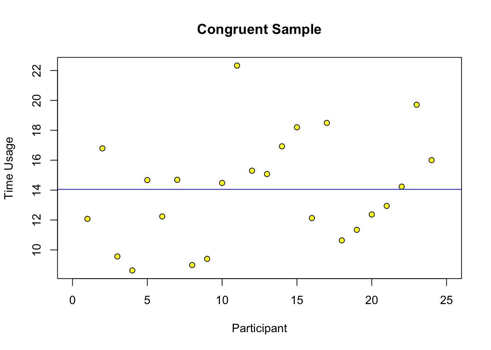
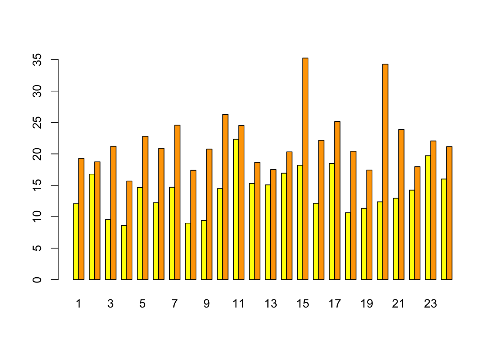
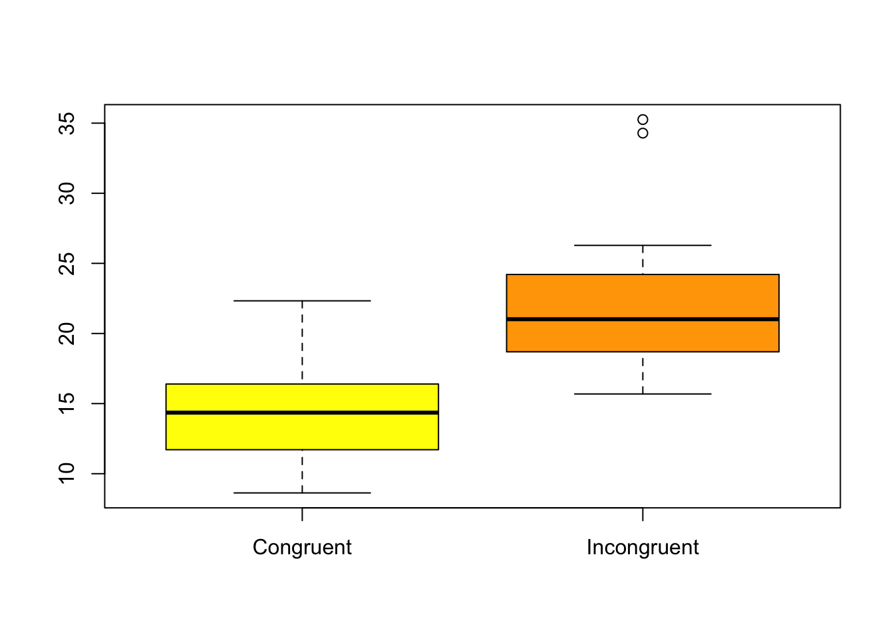

# Proj2 - Statistics of Stroop Task

```
Author: Xiao Liu
Time: 08/10/2017
```

## Background Information

In a Stroop task, participants are presented with a list of words, with each word displayed in a color of ink. The participant’s task is to say out loud the color of the ink in which the word is printed. The task has two conditions: a congruent words condition, and an incongruent words condition. In the congruent words condition, the words being displayed are color words whose names match the colors in which they are printed: for example RED(red), BLUE(blue). In the incongruent words condition, the words displayed are color words whose names do not match the colors in which they are printed: for example PURPLE(green), ORANGE(purple). In each case, we measure the time it takes to name the ink colors in equally-sized lists. Each participant will go through and record a time from each condition.


## Investigation

### Type of data
Dependent t-test for two conditions paired samples

### What is independent variable?

Two conditions: **congruent words** and **incongruent words**

### What is dependent variable?

The time people take to name ink colors in equally-sized lists

### Test hypothesis -- null typothesis
The time used to reading list of incongruent words has no abvious longer than reading congruent words list

`$H_0: \mu_c \geq \mu_i$`

### Test hypothesis -- alternative typothesis
The time used to read list of incongruent words will be larger than the time in congruent words list

``$H_A: \mu_c < \mu_i$``

### t-test
Based on the alternative hypothesis, t-test will be `one-tailed test in positive direction`

Find the t-critical values for a one-tailed test at `$\alpha=0.05$`:  
`$t_{critical} = 1.711$`


### Data at a glance





### Statistics tests

`$n = 24$`

`$df = n-1 = 23$`

`$\mu_c = 14.05; \sigma_c = 3.56$`

`$\mu_i = 22.02; \sigma_i = 4.80$`

mean of difference between two conditions:  
`$M_D = 7.96$`

standard deviation of difference:  
`$S_D = \sqrt{\frac{\sum{(D_{i} - \bar{D})^2}}{n - 1}} = 4.86$`

standard error of mean:  
`$SEM = \frac{S_D}{\sqrt{n}} = 0.99$`

t-statistic:  
`$t_{statistic} = \frac{M_D}{SEM} = 8.04$`

95% confident interval for the mean difference:  

`$CI: M_D \pm t_{critical} \times (SEM) = (6.27, 9.65)$`


**Desisions**  
Based on the t-statistic and t-critical value:
1. The results are statistically significant
2. **Reject the null** because `p < 0.05`
3. The time used to read list of incongruent words will be larger than the time in congruent words list
4. The result matches expectations because the incongruent task is much harder than congruent words. It takes longer time.


## Optional:

Cohen's d:  
`$Cohen's\;d = \frac{M_D}{S_D} = 1.64$`

Proportion(%) of variability in longer time due to incongruent words list:    
`$r^2 = \frac{t^2}{t^2 + df} = 0.74$`

According to effect size measures, it is responsible for the effect observed.

Color stroop test can have many variations, such as warped words, emotional, spatial, numerical, etc. They all keep the same people do a normal test, and do a harder varianced test. The data sample should be similar effects.


